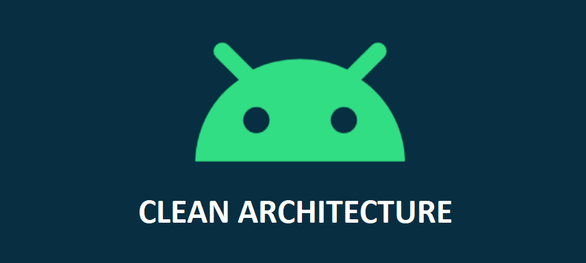

 
</a>

# Android Clean Architecture 

This is a sample movie list  Android application 📱 built to demonstrate use of *Clean Architecture* tools. Dedicated to all Android Developers with ❤️. 

***You can Install and test latest app from below 👇***

## - About
It simply loads list todos from [{JSON} Placeholder](https://jsonplaceholder.typicode.com/) and stores it in persistence storage (i.e. Room Database). Todos list will be always loaded from local database. Remote data (from API) and Local data is always synchronized.
- Modular approch followed
- It is heavily implemented by following standard clean architecture principle.
- Offline capability.
- [S.O.L.I.D](https://en.wikipedia.org/wiki/SOLID) priciple followed for more understandable, flexible and maintainable.

## - Built With 🛠
- [Kotlin](https://kotlinlang.org/) - First class and official programming language for Android development.
- [Android Architecture Components](https://developer.android.com/topic/libraries/architecture) - Collection of libraries that help you design robust, testable, and maintainable apps.
  - [ViewModel](https://developer.android.com/topic/libraries/architecture/viewmodel) - Stores UI-related data that isn't destroyed on UI changes. 
  - [Room](https://developer.android.com/topic/libraries/architecture/room) - SQLite object mapping library.
  - [Hilt](https://dagger.dev/hilt/) - Dependency Injection Framework
- [Retrofit](https://square.github.io/retrofit/) - A type-safe HTTP client for Android and Java.
- [OkHttp](http://square.github.io/okhttp/) - HTTP client that's efficient by default: HTTP/2 support allows all requests to the same host to share a socket
- [Ktlint](https://github.com/pinterest/ktlint) - Ktlint is a static code analysis tool maintain by Pinterest. Linter and formatter for Kotlin code.

## - Clean Architecture

- photo by: <a href="https://www.raywenderlich.com/3595916-clean-architecture-tutorial-for-android-getting-started">raywenderlich</a>

### What is clean architecture?
Architecture means the overall design of the project. It's the organization of the code into classes or files or components or modules. And it's how all these groups of code relate to each other. The architecture defines where the application performs its core functionality and how that functionality interacts with things like the database and the user interface.

### Why the cleaner approach?
1. Separation of code in different layers with assigned responsibilities making it easier for further modification.
2. High level of abstraction
3. Loose coupling between the code
4. Testing of code is painless
> Clean code always looks like it was written by someone who cares. - by Michael Feathers”

### Layers
- **Domain** - Would execute business logic which is independent of any layer and is just a pure kotlin/java package with no android specific dependency.
- **Data** - Would dispense the required data for the application to the domain layer by implementing interface exposed by the domain.
- **Presentation / framework** - Would include both domain and data layer and is android specific which executes the UI logic.

## - Current App's Architecture
This app uses [***MVVM (Model View View-Model)***](https://developer.android.com/jetpack/docs/guide#recommended-app-arch) architecture.

